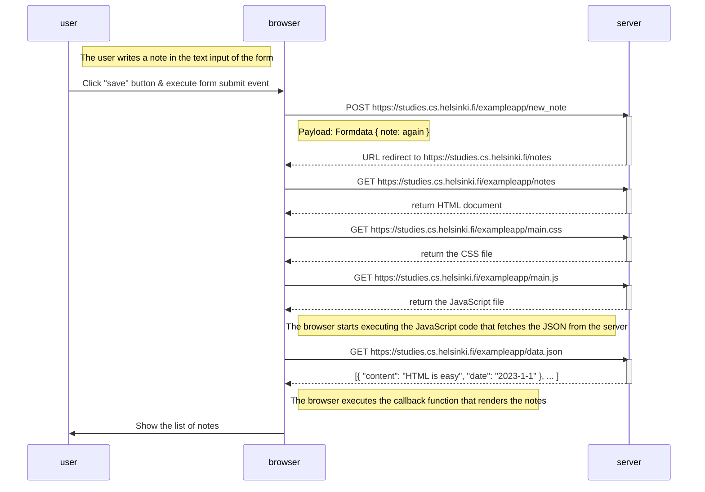

# Sequence diagram of create a note

```mermaid
sequenceDiagram
    participant user
    participant browser
    participant server

    Note right of user: The user writes a note in the text input of the form

    user ->> browser: Click "save" button & execute form submit event
    browser ->> server: POST https://studies.cs.helsinki.fi/exampleapp/new_note
    activate server
    Note right of browser: Payload: Formdata { note: again }

    server -->> browser: URL redirect to https://studies.cs.helsinki.fi/notes
    deactivate server

    browser ->> server: GET https://studies.cs.helsinki.fi/exampleapp/notes
    activate server
    server -->> browser: return HTML document
    deactivate server

    browser ->> server: GET https://studies.cs.helsinki.fi/exampleapp/main.css
    activate server
    server -->> browser: return the CSS file
    deactivate server

    browser ->> server: GET https://studies.cs.helsinki.fi/exampleapp/main.js
    activate server
    server -->> browser: return the JavaScript file
    deactivate server

    Note right of browser: The browser starts executing the JavaScript code that fetches the JSON from the server

    browser ->> server: GET https://studies.cs.helsinki.fi/exampleapp/data.json
    activate server
    server -->> browser: [{ "content": "HTML is easy", "date": "2023-1-1" }, ... ]
    deactivate server

    Note right of browser: The browser executes the callback function that renders the notes

    browser ->> user: Show the list of notes
```
