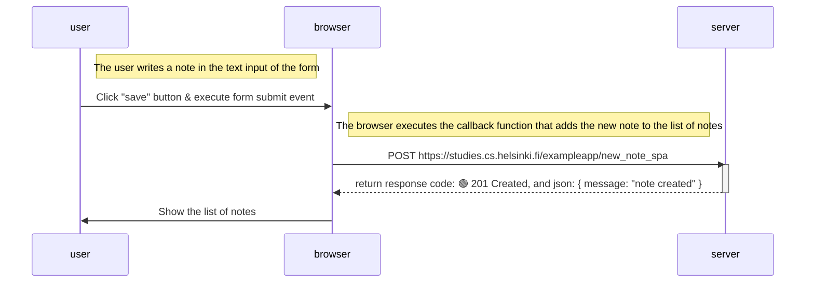

# Sequence diagram of create a note in spa app

```mermaid
sequenceDiagram
    participant user
    participant browser
    participant server

    Note right of user: The user writes a note in the text input of the form

    user ->> browser: Click "save" button & execute form submit event

    Note right of browser: The browser executes the callback function that adds the new note to the list of notes

    browser ->> server: POST https://studies.cs.helsinki.fi/exampleapp/new_note_spa
    activate server
    server -->> browser: return response code: 🟢 201 Created, and json: { message: "note created" }
    deactivate server

    browser ->> user: Show the list of notes
```
